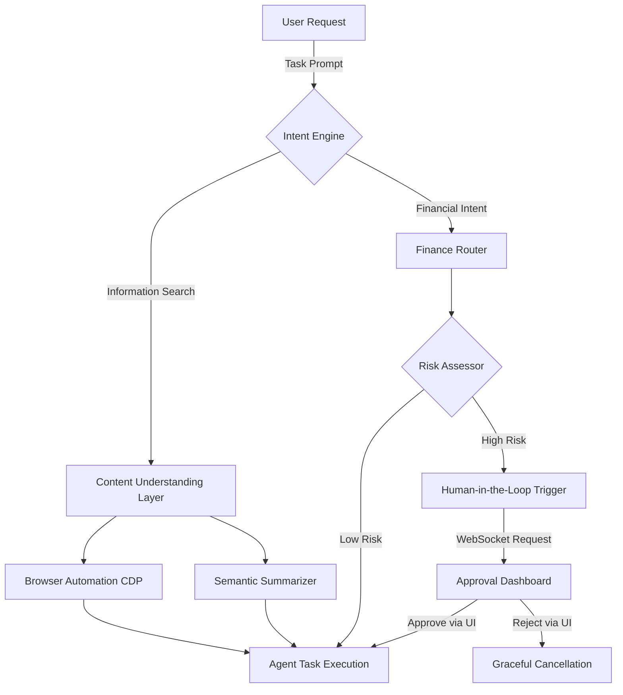
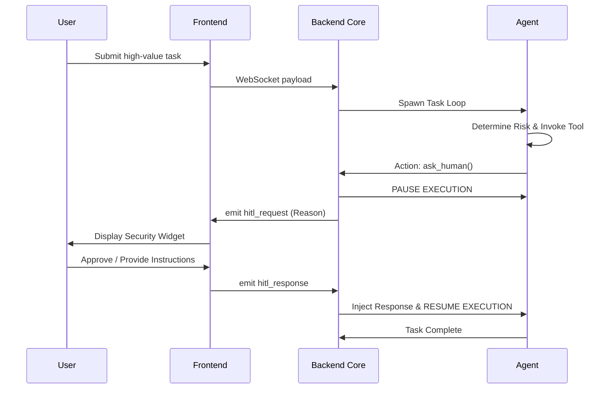

SentinAL AI</h1>

  

    <strong>Autonomous. Intelligent. Secure.</strong>
  

  

    An AI-native browser architecture that transforms the web from a chaotic stream of information into an intelligent, action-oriented workspace. SentinAL understands user intent, filters noise, and delivers trusted insights with securely governed execution workflows.
  

## Table of Contents
1. [Overview](#overview)
2. [Comparative Advantage](#comparative-advantage)
3. [System Architecture](#system-architecture)
4. [Financial Core & Security Governance](#financial-core--security-governance)
5. [Getting Started](#getting-started)
6. [License](#license)

---

## Overview

Traditional browsers force users to manually search, verify, and connect information across multiple tabs and separate applications. SentinAL replaces this fragmented experience with a unified environment that prioritizes understanding, verification, and autonomous but secure action. By introducing proactive AI agents, SentinAL AI bridges the gap between passive consumption and active execution.

---

## Comparative Advantage

SentinAL shifts the paradigm from self-service browsing to outcome-driven delegation.

| Capability | Traditional Browser | SentinAL AI |
| :--- | :--- | :--- |
| **Content Navigation** | Manual tabulation and reading | Semantic extraction and intelligent summarization |
| **Verification** | User-led research across sources | Automated fact-checking and trust confidence scoring |
| **Task Execution** | User inputs data manually | Autonomous multi-step orchestration (CDP-based) |
| **Transaction Security**| Rely on external bank verification | Integrated Finance Core with FinBERT analysis |
| **Interface Priority** | Maximizing visual screen real estate | Maximizing decision-making and clear insights |

---

## System Architecture

The SentinAL Architecture is modular, decoupling content extraction from the agent intelligence loops and the Human-in-the-Loop security checks.

### Core Layers Explained

1. **Content Understanding Layer**: Processes raw HTML and DOM trees into compressed, semantically rich markdown representations without losing core structure.
2. **Verification and Trust Layer**: Flags suspicious logic, cross-references claims, and computes reliability before the data is presented to the user.
3. **Agent Orchestration Layer**: The intelligent heartbeat. Manages state, handles language model integration, and pilots the browser autonomously.
4. **Action-First Interface**: A customized frontend built explicitly for agent oversight, delivering direct access to context streams and controls.

---

## Financial Core & Security Governance

SentinAL AI integrates specialized security modules to guarantee precision and safety when dealing with irreversible operations. 

### Feature Specifications

| Component | Description | Integration Standard |
| :--- | :--- | :--- |
| **Intent Classification** | Identifies specific requests involving money, banking, or e-commerce operations. | FinBERT Analytics |
| **Automated Payment Gateways** | Directly interacts with payment URLs and payload interfaces for streamlined checkouts. | Native Paytm Support |
| **Contextual Summarization** | Isolates critical fields (beneficiary, amount, ID) independently of the noise on the broader page. | LLM Schema Extraction |

### Human-in-the-Loop (HITL) Protocol

To ensure 100% control over the agent's permissions, an overarching HITL protocol governs the entire lifecycle of operations.

- **Autonomous Pausing**: If the `ask_human` tool is triggered by the risk assessor, the backend suspends the main event loop immediately to prevent irreversible actions.
- **Synchronous Override Interface**: A localized frontend widget intercepts the payload, requiring definitive user approval or rejection before unblocking the process.
- **Dynamic Context Injection**: The user's response is directly appended to the agent's short-term memory, ensuring contextual awareness of the override directive.

---